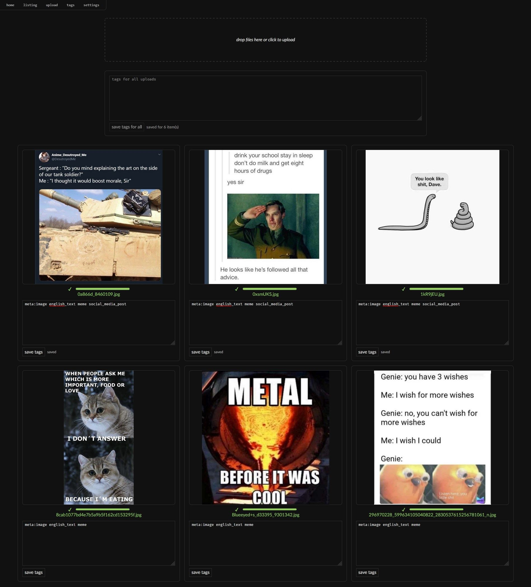
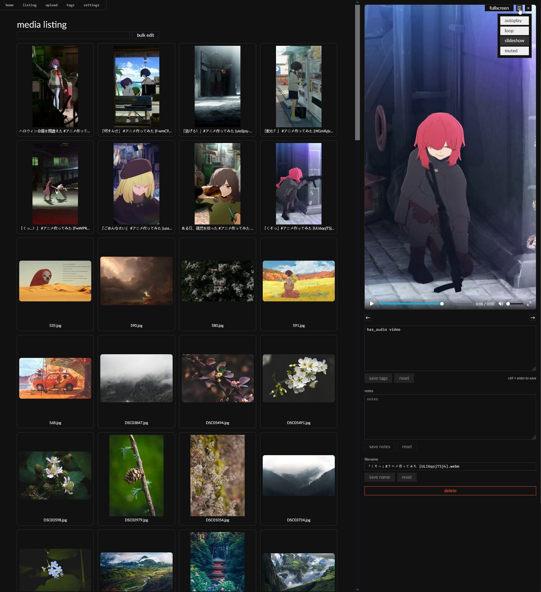
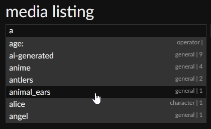
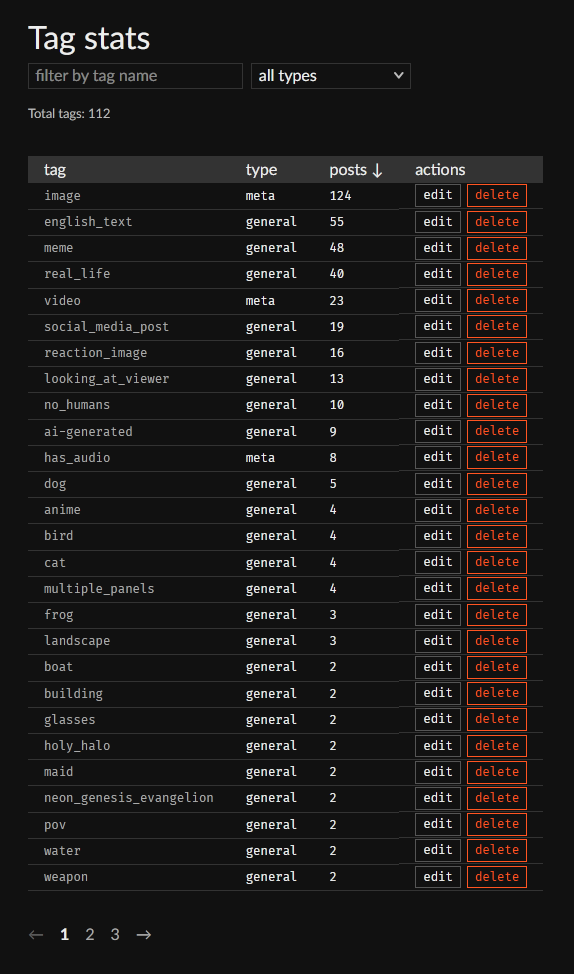
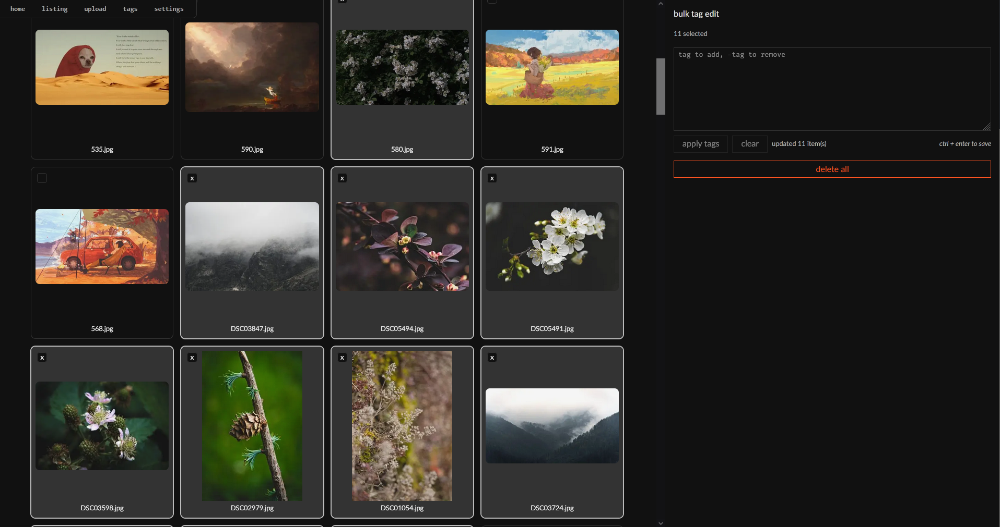
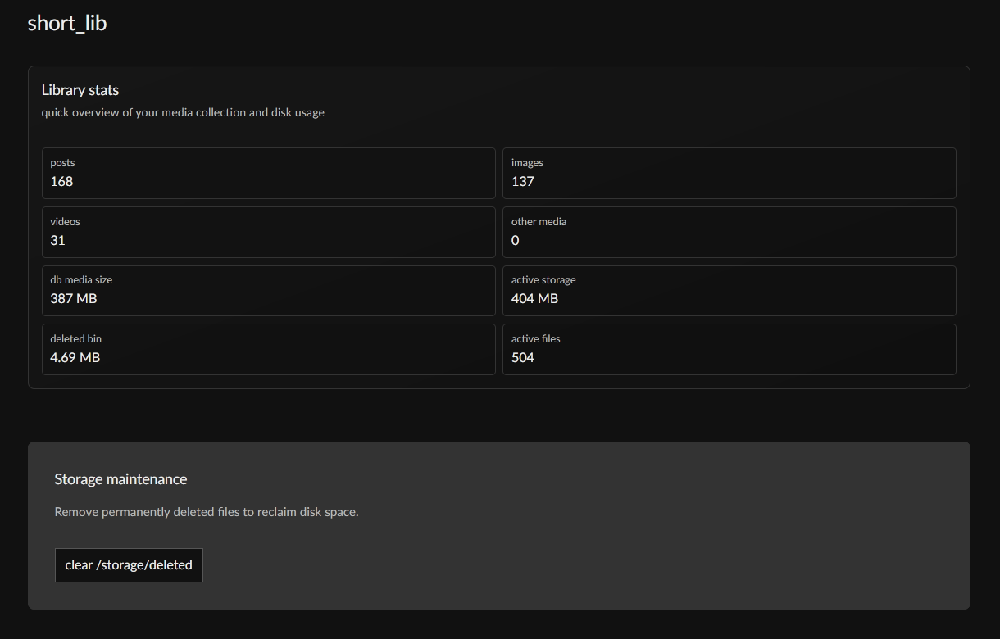

# short_lib

A personal, local, media library built around a web UI using Next.js, React, and SQLite. Supports tagging and search extended with metadata like resolution, duration, age, aspect ratio, etc - [full reference](docs/SEARCH_SYNTAX.md)

## What can you do with it

- Upload images and videos, it automatically generates thumbnails and adds basic tags.
- Search with tag logic (`AND`/`OR`/negation) plus operator filters.
- Edit tags, notes, and filenames. Tags can be edited in bulk.
- Soft-delete media into a deleted bin and clear it from the UI.
- Preview and play/slideshow the filtered list of media in fullscreen.

## Screenshots

### Upload



### Listing



### Search and tag suggestions



### Tag list



### Bulk edit



### Global stats



## Limitations

- Limited Matroska video support.
- No support for video features like multiple tracks, subtitles, etc.
- Downloading files from the library has to either be done one by one or by manually copying files from the `STORAGE_DIR`.
- No user accounts.

## Prerequisites

- Node.js + npm
- `ffmpeg` and `ffprobe` available on `PATH` for full video support
  - video metadata extraction (`ffprobe`)
  - video preview frame extraction (`ffmpeg`)
  - MKV streaming remux to MP4 (`ffmpeg`)

## Quick start

1. Install dependencies:

```bash
npm install
```

2. Create your local `.env` from the example and adjust values as needed:

Example `.env`:

```env
STORAGE_DIR=H:/short_lib/storage/
THUMB_PIXELS=100000
PREVIEW_PIXELS=1000000
```
- `STORAGE_DIR`: base directory for media files and generated derivatives.
- `THUMB_PIXELS`: target total pixels for thumbnail generation.
- `PREVIEW_PIXELS`: target total pixels for preview generation. (Right now previews are not displayed anywhere yet)
- All three values above are required for the upload pipeline.

3. Start development server:

```bash
npm run dev
```

4. Open `http://localhost:3000`.

## Typesense via Docker

This repo includes a local Typesense service definition for search indexing:

1. Make sure Docker Desktop is running.
2. Set these in your `.env`:

```env
TYPESENSE_HOST=http://localhost:8108
TYPESENSE_API_KEY=replace-me-with-a-long-random-string
```

3. Start Typesense:

```bash
npm run typesense:up
```

4. Check service health:

```bash
curl http://localhost:8108/health
```

5. Stop it when needed:

```bash
npm run typesense:down
```

Typesense data is persisted under `./storage/typesense`.

## Implementation details

### Storage layout

`STORAGE_DIR` uses these folders:

- `full/YYYY/MM/<checksum>.<ext>` - original uploaded media
- `thumbs/YYYY/MM/<checksum>.jpg` - thumbnail derivative
- `prevs/YYYY/MM/<checksum>.jpg` - preview derivative
- `tmp/` - temporary upload/transcode files
- `deleted/` - soft-deleted files (same sub-structure as above)

Deleting a post moves files into the `/deleted` folder. It can be cleared manually or using the UI.

### Backup and migration

To move or back up the full library, keep the entire `STORAGE_DIR` folder (all media + derivatives + `shortlib.db`).

When restoring on another machine/path, copy `STORAGE_DIR` and update `.env` (`STORAGE_DIR=...`) if the storage location changes.

### Architecture notes

[docs/ARCHITECTURE.md](docs/ARCHITECTURE.md)
